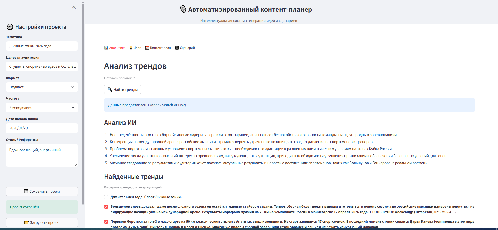
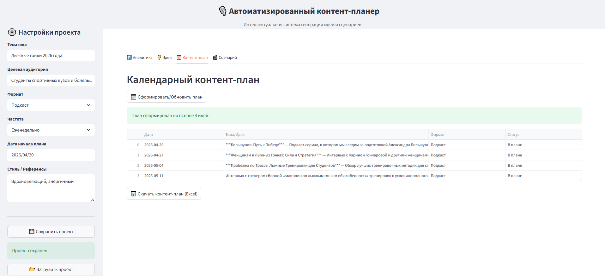
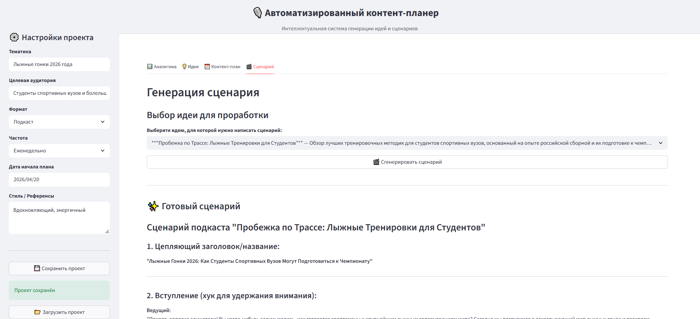

Podcast Planner AI — интеллектуальный ассистент для автоматизации полного цикла подготовки подкастов.
Система анализирует актуальные поисковые тренды, генерирует структурированные планы выпусков и полноценные сценарии.
Решение полностью контейнеризировано с помощью Docker, что обеспечивает быстрый деплой и стабильную работу на любом сервере.

